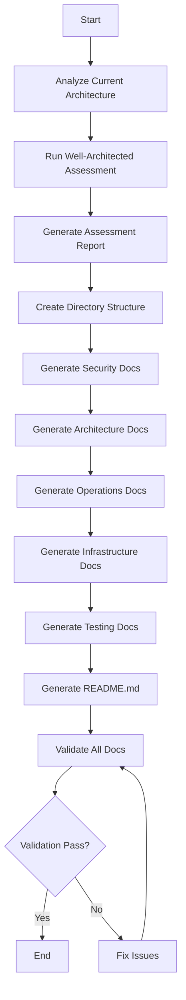

# Design Document

## Overview

Hệ thống tài liệu AWS Well-Architected Framework được thiết kế để cung cấp đánh giá toàn diện kiến trúc AWS Serverless hiện tại theo 5 trụ cột (Security, Reliability, Performance Efficiency, Cost Optimization, Operational Excellence). Tài liệu được tổ chức theo phương pháp BMAD-METHOD với cấu trúc tutorials/, how-to/, explanation/, reference/ để phục vụ cả người mới bắt đầu và chuyên gia.

Hệ thống này không phải là một ứng dụng chạy được, mà là một bộ tài liệu Markdown được tạo tự động với:
- Cấu trúc thư mục rõ ràng theo BMAD-METHOD
- Templates chuẩn hóa cho từng loại tài liệu
- Code examples và configuration templates có thể triển khai ngay
- Nội dung bằng Tiếng Việt với thuật ngữ kỹ thuật giữ nguyên

## Architecture

### Kiến Trúc Tổng Thể

```
docs/
├── README.md                          # Tổng quan hệ thống tài liệu mới
├── architecture/                      # Tài liệu kiến trúc
│   ├── tutorials/                     # Hướng dẫn từng bước
│   ├── how-to/                        # Hướng dẫn giải quyết vấn đề cụ thể
│   ├── explanation/                   # Giải thích khái niệm
│   └── reference/                     # Tài liệu tham chiếu
├── security/                          # Tài liệu bảo mật
│   ├── tutorials/
│   ├── how-to/
│   ├── explanation/
│   └── reference/
├── operations/                        # Tài liệu vận hành
│   ├── tutorials/
│   ├── how-to/
│   ├── explanation/
│   └── reference/
├── infrastructure/                    # Tài liệu hạ tầng
│   ├── tutorials/
│   ├── how-to/
│   ├── explanation/
│   └── reference/
└── testing/                           # Tài liệu kiểm thử
    ├── tutorials/
    ├── how-to/
    ├── explanation/
    └── reference/
```

### Nguyên Tắc Thiết Kế

1. **BMAD-METHOD Structure**: Mỗi domain (architecture, security, operations, infrastructure, testing) có 4 loại tài liệu:
   - **tutorials/**: Hướng dẫn từng bước cho người mới bắt đầu
   - **how-to/**: Hướng dẫn giải quyết vấn đề cụ thể
   - **explanation/**: Giải thích khái niệm, lý thuyết
   - **reference/**: Tài liệu tham chiếu, API, configuration

2. **Actionable Content**: Mọi tài liệu đều phải có code examples hoặc configuration templates có thể triển khai ngay

3. **Free Tier First**: Ưu tiên các giải pháp trong AWS Free Tier, cảnh báo rõ ràng khi vượt Free Tier

4. **Vietnamese with Technical Terms**: Nội dung bằng Tiếng Việt, giữ nguyên thuật ngữ kỹ thuật tiếng Anh

## Components and Interfaces

### 1. Document Generator

**Mục đích**: Tạo các file tài liệu Markdown theo templates chuẩn hóa

**Chức năng**:
- Tạo cấu trúc thư mục theo BMAD-METHOD
- Tạo file tài liệu từ templates
- Điền nội dung vào templates dựa trên Well-Architected Review

**Input**: 
- Current architecture information (từ source code và infrastructure)
- Well-Architected Framework assessment criteria

**Output**: 
- Markdown files trong cấu trúc docs/

### 2. Template System

**Mục đích**: Cung cấp templates chuẩn hóa cho từng loại tài liệu

**Templates chính**:

#### 2.1 Tutorial Template
```markdown
# [Tiêu đề Tutorial]

## Mục tiêu

[Mô tả mục tiêu học tập]

## Điều kiện tiên quyết

- [Kiến thức cần có]
- [Công cụ cần cài đặt]
- [AWS services cần thiết]

## Các bước thực hiện

### Bước 1: [Tên bước]

[Mô tả chi tiết]

```[language]
[Code example]
```

**Giải thích**:
[Giải thích code]

### Bước 2: [Tên bước]

[Tiếp tục...]

## Kiểm tra kết quả

[Cách kiểm tra xem đã thành công chưa]

## Tổng kết

[Tóm tắt những gì đã học]

## Bước tiếp theo

- [Link đến tài liệu liên quan]
```

#### 2.2 How-To Template
```markdown
# [Tiêu đề How-To]

## Vấn đề

[Mô tả vấn đề cần giải quyết]

## Giải pháp

[Tóm tắt giải pháp]

## Điều kiện tiên quyết

- [Yêu cầu]

## Các bước thực hiện

### 1. [Bước 1]

```[language]
[Code/Configuration]
```

### 2. [Bước 2]

[Tiếp tục...]

## Xác minh

[Cách kiểm tra giải pháp hoạt động]

## Lưu ý

- [Lưu ý quan trọng]
- [Cảnh báo về chi phí nếu có]

## Tài liệu liên quan

- [Links]
```

#### 2.3 Explanation Template
```markdown
# [Tiêu đề Explanation]

## Tổng quan

[Giới thiệu khái niệm]

## Khái niệm cơ bản

### [Khái niệm 1]

[Giải thích chi tiết]

### [Khái niệm 2]

[Giải thích chi tiết]

## Tại sao quan trọng?

[Giải thích tầm quan trọng]

## Best Practices

1. [Best practice 1]
2. [Best practice 2]

## Anti-patterns

[Những gì nên tránh]

## Ví dụ thực tế

[Case studies hoặc examples]

## Tài liệu liên quan

- [Links]
```

#### 2.4 Reference Template
```markdown
# [Tiêu đề Reference]

## Mô tả

[Mô tả ngắn gọn]

## Cú pháp

```[language]
[Syntax]
```

## Tham số

| Tham số | Kiểu | Bắt buộc | Mô tả |
|---------|------|----------|-------|
| [param] | [type] | [yes/no] | [description] |

## Ví dụ

### Ví dụ 1: [Mô tả]

```[language]
[Code example]
```

### Ví dụ 2: [Mô tả]

```[language]
[Code example]
```

## Lưu ý

- [Important notes]

## Xem thêm

- [Related references]
```

### 3. Content Modules

Mỗi domain có các content modules riêng:

#### 3.1 Security Module

**Tài liệu chính**:
- `security/how-to/security-hardening.md`: Hướng dẫn hardening toàn diện
- `security/reference/iam-policies.md`: IAM policies theo Least Privilege
- `security/how-to/waf-configuration.md`: Cấu hình WAF
- `security/how-to/cognito-advanced.md`: Cấu hình Cognito nâng cao

**Code Examples**:
- IAM policy cho Lambda với Least Privilege
- WAF rules cho API Gateway
- Cognito MFA configuration
- S3 bucket policy để chặn public access
- CloudFront security headers configuration

#### 3.2 Architecture Module

**Tài liệu chính**:
- `architecture/explanation/scalability-design.md`: Thiết kế khả năng mở rộng
- `architecture/reference/architecture-decisions.md`: Architecture Decision Records (ADR)

**Code Examples**:
- DynamoDB auto-scaling configuration
- Lambda warming strategies
- API Gateway throttling configuration

#### 3.3 Operations Module

**Tài liệu chính**:
- `operations/how-to/cost-optimization.md`: Tối ưu chi phí
- `operations/how-to/monitoring-alerting.md`: Giám sát và cảnh báo
- `operations/reference/runbooks.md`: Cẩm nang vận hành
- `operations/how-to/backup-recovery.md`: Sao lưu và phục hồi

**Code Examples**:
- CloudWatch Alarms configuration
- CloudWatch Dashboard JSON
- AWS Billing Alerts
- DynamoDB PITR configuration
- S3 lifecycle policies

#### 3.4 Infrastructure Module

**Tài liệu chính**:
- `infrastructure/reference/cloudformation-templates.md`: CloudFormation/SAM templates
- `infrastructure/how-to/cicd-pipeline.md`: CI/CD pipeline nâng cao

**Code Examples**:
- CloudFormation template cho WAF
- CloudFormation template cho enhanced monitoring
- GitHub Actions workflows
- AWS CodePipeline configuration

#### 3.5 Testing Module

**Tài liệu chính**:
- `testing/how-to/load-testing.md`: Kiểm thử tải
- `testing/how-to/security-testing.md`: Kiểm thử bảo mật
- `testing/how-to/chaos-engineering.md`: Chaos engineering

**Code Examples**:
- Artillery/k6 load test scripts
- OWASP security test scripts
- AWS Fault Injection Simulator experiments

### 4. Well-Architected Assessment Engine

**Mục đích**: Đánh giá kiến trúc hiện tại theo 5 trụ cột AWS Well-Architected Framework

**Input**: Current architecture (CloudFront, S3, Cognito, API Gateway, Lambda, DynamoDB, CloudWatch)

**Output**: Assessment report với:
- Điểm đánh giá cho mỗi trụ cột (High/Medium/Low risk)
- Ít nhất 3 vấn đề ưu tiên cao cho mỗi trụ cột
- Recommendations cụ thể

**Assessment Criteria**:

**Security Pillar**:
- IAM policies quá rộng (High risk)
- Thiếu WAF (High risk)
- Thiếu MFA cho Cognito (High risk)
- S3 buckets có public access (High risk)
- Thiếu security headers trong CloudFront (Medium risk)
- Thiếu encryption at rest (Medium risk)
- Thiếu VPC cho Lambda (Low risk)

**Reliability Pillar**:
- DynamoDB sử dụng Provisioned Capacity (High risk - không auto-scale)
- Thiếu multi-region backup (High risk)
- Thiếu health checks (Medium risk)
- Thiếu retry logic (Medium risk)
- Thiếu circuit breaker (Low risk)

**Performance Pillar**:
- Lambda cold start (High risk)
- Thiếu CloudFront caching optimization (Medium risk)
- Thiếu DynamoDB DAX (Medium risk)
- Thiếu API Gateway caching (Low risk)

**Cost Optimization Pillar**:
- Thiếu cost monitoring (High risk)
- Lambda memory không được optimize (Medium risk)
- DynamoDB capacity không được right-size (Medium risk)
- Thiếu S3 lifecycle policies (Low risk)

**Operational Excellence Pillar**:
- Thiếu comprehensive monitoring (High risk)
- Thiếu automated deployment (High risk)
- Thiếu runbooks (High risk)
- Thiếu log aggregation (Medium risk)
- Thiếu automated testing (Medium risk)

## Data Models

### Document Metadata

```typescript
interface DocumentMetadata {
  title: string;                    // Tiêu đề tài liệu
  category: 'tutorial' | 'how-to' | 'explanation' | 'reference';
  domain: 'architecture' | 'security' | 'operations' | 'infrastructure' | 'testing';
  tags: string[];                   // Tags để tìm kiếm
  relatedDocs: string[];            // Links đến tài liệu liên quan
  lastUpdated: Date;
  freeTierCompatible: boolean;      // Có tương thích với Free Tier không
  estimatedCost?: string;           // Ước tính chi phí nếu vượt Free Tier
}
```

### Code Example Metadata

```typescript
interface CodeExample {
  language: string;                 // typescript, yaml, json, bash, etc.
  code: string;                     // Code content
  description: string;              // Mô tả code
  dependencies?: string[];          // Dependencies cần thiết
  environmentVariables?: Record<string, string>; // Environment variables
  deploymentInstructions?: string;  // Hướng dẫn deployment
  freeTierWarning?: string;         // Cảnh báo về Free Tier nếu có
}
```

### Well-Architected Assessment

```typescript
interface AssessmentResult {
  pillar: 'security' | 'reliability' | 'performance' | 'cost' | 'operations';
  issues: Issue[];
  overallRisk: 'high' | 'medium' | 'low';
}

interface Issue {
  title: string;
  description: string;
  risk: 'high' | 'medium' | 'low';
  currentState: string;             // Tình trạng hiện tại
  recommendation: string;           // Khuyến nghị cải thiện
  implementationGuide: string;      // Link đến hướng dẫn triển khai
  codeExamples: CodeExample[];      // Code examples cụ thể
}
```

## Error Handling

Vì đây là hệ thống tạo tài liệu (không phải runtime application), error handling tập trung vào:

### 1. Template Validation

- Kiểm tra tất cả templates có đầy đủ sections bắt buộc
- Kiểm tra code examples có syntax hợp lệ
- Kiểm tra links giữa các tài liệu không bị broken

### 2. Content Quality Checks

- Kiểm tra tất cả code examples có thể chạy được
- Kiểm tra tất cả configuration templates có format hợp lệ
- Kiểm tra Free Tier warnings được đặt đúng chỗ

### 3. Documentation Completeness

- Kiểm tra mỗi domain có đủ 4 loại tài liệu (tutorials, how-to, explanation, reference)
- Kiểm tra mỗi issue trong Well-Architected Assessment có link đến implementation guide
- Kiểm tra tất cả thuật ngữ kỹ thuật được giải thích lần đầu xuất hiện

## Testing Strategy

### Unit Tests

Vì đây là documentation generation system, unit tests tập trung vào:

1. **Template Rendering Tests**
   - Test template có render đúng với input data
   - Test tất cả placeholders được thay thế
   - Test markdown syntax hợp lệ

2. **Code Example Validation Tests**
   - Test TypeScript code examples compile được
   - Test YAML/JSON configuration có valid syntax
   - Test bash scripts có syntax hợp lệ

3. **Link Validation Tests**
   - Test tất cả internal links trỏ đến file tồn tại
   - Test tất cả external links không bị broken (optional)

4. **Content Quality Tests**
   - Test mỗi code example có description
   - Test mỗi Free Tier warning được đặt đúng
   - Test mỗi tài liệu có metadata đầy đủ

### Integration Tests

1. **End-to-End Documentation Generation**
   - Test tạo toàn bộ cấu trúc docs/ từ đầu
   - Test tất cả files được tạo đúng vị trí
   - Test nội dung files đúng với expected output

2. **Well-Architected Assessment**
   - Test assessment engine đánh giá đúng current architecture
   - Test tất cả 5 pillars được đánh giá
   - Test mỗi pillar có ít nhất 3 high-priority issues

### Manual Testing

1. **Content Review**
   - Review tất cả tài liệu bằng Tiếng Việt có ngữ pháp đúng
   - Review thuật ngữ kỹ thuật được sử dụng nhất quán
   - Review code examples có thể chạy được trong môi trường thực

2. **User Experience Testing**
   - Test người mới có thể follow tutorials
   - Test developers có thể tìm được how-to guides nhanh chóng
   - Test navigation giữa các tài liệu rõ ràng

## Implementation Notes

### Workflow Tạo Tài Liệu



### Ưu Tiên Triển Khai

**Phase 1: Core Structure**
1. Tạo cấu trúc thư mục BMAD-METHOD
2. Tạo templates cơ bản
3. Tạo README.md tổng quan

**Phase 2: Security Documentation**
4. Tạo security hardening guide
5. Tạo IAM policies reference
6. Tạo WAF configuration guide
7. Tạo Cognito advanced guide

**Phase 3: Operations Documentation**
8. Tạo monitoring & alerting guide
9. Tạo runbooks
10. Tạo backup & recovery guide
11. Tạo cost optimization guide

**Phase 4: Architecture & Infrastructure**
12. Tạo scalability design guide
13. Tạo architecture decisions (ADR)
14. Tạo CloudFormation templates
15. Tạo CI/CD pipeline guide

**Phase 5: Testing Documentation**
16. Tạo load testing guide
17. Tạo security testing guide
18. Tạo chaos engineering guide

**Phase 6: Well-Architected Assessment**
19. Implement assessment engine
20. Generate assessment report
21. Link assessment issues to implementation guides

### Technology Stack

- **Language**: TypeScript (cho scripts tạo tài liệu nếu cần automation)
- **Output Format**: Markdown
- **Validation**: 
  - `markdownlint` cho markdown syntax
  - `tsc` cho TypeScript code examples
  - `yamllint` cho YAML configurations
  - Custom scripts cho link validation

### Free Tier Considerations

Tất cả giải pháp được thiết kế để hoạt động trong AWS Free Tier:

**Free Tier Limits**:
- Lambda: 1M requests/month, 400,000 GB-seconds compute
- DynamoDB: 25 GB storage, 25 WCU, 25 RCU
- API Gateway: 1M API calls/month (12 months)
- CloudFront: 50 GB data transfer out, 2M HTTP/HTTPS requests
- S3: 5 GB storage, 20,000 GET requests, 2,000 PUT requests
- CloudWatch: 10 custom metrics, 10 alarms, 5 GB log ingestion

**Cost Warnings**:
- WAF: $5/month + $1/rule (KHÔNG có Free Tier) - cảnh báo rõ ràng
- DynamoDB On-Demand: Vượt Free Tier nếu traffic cao - đề xuất Provisioned với auto-scaling
- CloudWatch Logs: Vượt 5 GB/month - hướng dẫn log filtering
- Lambda: Vượt 400,000 GB-seconds - hướng dẫn optimize memory

## Appendix

### Glossary

- **BMAD-METHOD**: Phương pháp tổ chức tài liệu với 4 loại: tutorials, how-to, explanation, reference
- **Well-Architected Framework**: Khung đánh giá kiến trúc AWS theo 5 trụ cột
- **Free Tier**: Gói miễn phí của AWS cho người dùng mới (12 tháng) và một số dịch vụ miễn phí vĩnh viễn
- **Least Privilege**: Nguyên tắc chỉ cấp quyền tối thiểu cần thiết
- **Infrastructure as Code (IaC)**: Quản lý hạ tầng bằng code (CloudFormation, Terraform)
- **Runbook**: Cẩm nang vận hành với các bước xử lý sự cố cụ thể

### References

- [AWS Well-Architected Framework](https://aws.amazon.com/architecture/well-architected/)
- [AWS Free Tier](https://aws.amazon.com/free/)
- [BMAD-METHOD Documentation](https://docs.bmad-method.org/)
- [AWS Security Best Practices](https://docs.aws.amazon.com/security/)
- [AWS Serverless Best Practices](https://docs.aws.amazon.com/lambda/latest/dg/best-practices.html)
