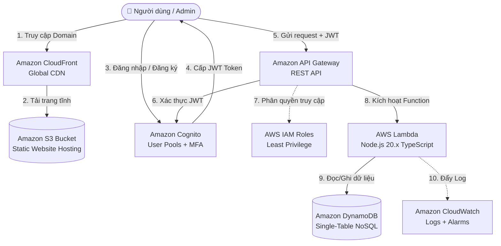
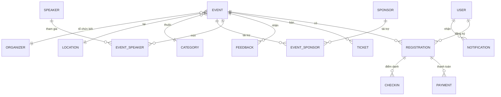

# 📋 BÁO CÁO DỰ ÁN
# AWS Serverless Event Management Portal

---

| Thông tin | Chi tiết |
|-----------|----------|
| **Tên dự án** | AWS Serverless Event Management Portal (Cổng Quản Lý Sự Kiện Trực Tuyến) |
| **Phiên bản** | 1.0.0 |
| **Giấy phép** | MIT |
| **Phương pháp** | BMAD Method v6 (Breakthrough Method for Agile AI-Driven Development) |
| **Ngày báo cáo** | 18/07/2026 |

---

## 📌 1. Tổng Quan Dự Án

### 1.1. Mô Tả

**AWS Serverless Event Management Portal** là một hệ thống quản lý và đăng ký sự kiện trực tuyến, được thiết kế theo mô hình **Serverless 100%** (không máy chủ). Hệ thống sử dụng các dịch vụ lõi của Amazon Web Services (AWS) và được tối ưu hóa cấu hình để **chạy hoàn toàn miễn phí trong gói AWS Free Tier** (Always Free và 12 Months Free).

### 1.2. Mục Tiêu Dự Án

- Xây dựng nền tảng quản lý sự kiện trực tuyến hoàn chỉnh, từ tạo sự kiện, đăng ký, thanh toán đến check-in.
- Áp dụng kiến trúc **Event-Driven Architecture** (hướng sự kiện), chỉ tính toán và kích hoạt tài nguyên khi có yêu cầu thực tế.
- Tối ưu hóa chi phí vận hành ở mức **0 đồng** bằng cách tận dụng AWS Free Tier.
- Tuân thủ **AWS Well-Architected Framework** trên 5 trụ cột: Security, Reliability, Performance, Cost Optimization, Operational Excellence.

### 1.3. Đối Tượng Sử Dụng

| Vai trò | Mô tả |
|---------|-------|
| **Người dùng (User)** | Xem sự kiện, đăng ký tham gia, mua vé, đánh giá sự kiện, nhận gợi ý cá nhân hóa |
| **Quản trị viên (Admin)** | Tạo/sửa/xóa sự kiện, quản lý đăng ký, điểm danh QR, quay số may mắn, xuất báo cáo |
| **Ban tổ chức (Organizer)** | Quản lý sự kiện, theo dõi thống kê, cấu hình chứng chỉ |

---

## 🏗️ 2. Kiến Trúc Hệ Thống

### 2.1. Sơ Đồ Kiến Trúc Tổng Quan



### 2.2. Công Nghệ Sử Dụng

| Tầng | Công nghệ | Phiên bản | Vai trò |
|------|-----------|-----------|---------|
| **Frontend** | React + TypeScript | React 19.x | Giao diện người dùng SPA |
| **Build Tool** | Vite | 8.x | Bundler và dev server |
| **Backend** | Node.js + TypeScript | Node.js 20.x | Lambda handlers |
| **Database** | Amazon DynamoDB | - | NoSQL Single-Table Design |
| **Authentication** | Amazon Cognito | - | User Pools + JWT + MFA |
| **API Gateway** | Amazon API Gateway | REST API | Cổng kết nối API |
| **CDN** | Amazon CloudFront | - | Phân phối nội dung toàn cầu |
| **Storage** | Amazon S3 | - | Lưu trữ trang web tĩnh |
| **IaC** | AWS SAM (CloudFormation) | - | Infrastructure as Code |
| **Monitoring** | Amazon CloudWatch | - | Log, Metrics, Alarms |
| **Xác thực SDK** | amazon-cognito-identity-js | 6.x | Cognito SDK cho frontend |

### 2.3. Monorepo Structure

Dự án sử dụng cấu trúc **Monorepo** với `npm workspaces`:

```
aws-serverless-event-portal/
├── frontend/                     # React + TypeScript (Vite)
├── backend/                      # AWS Lambda Handlers (TypeScript)
├── landing-page/                 # Trang giới thiệu
├── docs/                         # Tài liệu kiến trúc & kỹ thuật
├── huong dan cau hinh/           # Hướng dẫn triển khai CloudFormation
├── package.json                  # Monorepo root (npm workspaces)
└── README.md                     # Tài liệu chính
```

---

## 🗄️ 3. Thiết Kế Cơ Sở Dữ Liệu

### 3.1. Single-Table Design

Toàn bộ dữ liệu được tổ chức trong **một bảng duy nhất** `EventApp-Data`, hỗ trợ **17 thực thể nghiệp vụ** chỉ với **2 Global Secondary Indexes (GSIs)**:



### 3.2. Danh Sách 17 Thực Thể

| # | Thực Thể | Partition Key (PK) | Sort Key (SK) | Mục đích |
|---|----------|-------------------|---------------|----------|
| 1 | USER | `USER#<UserId>` | `METADATA` | Thông tin người dùng |
| 2 | EVENT | `EVENT#<EventId>` | `METADATA` | Thông tin sự kiện |
| 3 | REGISTRATION | `USER#<UserId>` | `EVENT#<EventId>` | Đăng ký sự kiện |
| 4 | TICKET | `EVENT#<EventId>` | `TICKET#<TicketId>` | Loại vé sự kiện |
| 5 | PAYMENT | `REG#<RegId>` | `PAYMENT#<PaymentId>` | Thanh toán |
| 6 | CHECKIN | `REG#<RegId>` | `CHECKIN#<Timestamp>` | Điểm danh |
| 7 | CATEGORY | `CAT#<CategoryId>` | `METADATA` | Danh mục sự kiện |
| 8 | LOCATION | `LOC#<LocationId>` | `METADATA` | Địa điểm |
| 9 | ORGANIZER | `ORG#<OrgId>` | `METADATA` | Ban tổ chức |
| 10 | SPEAKER | `SPEAKER#<SpeakerId>` | `METADATA` | Diễn giả |
| 11 | EVENT_SPEAKER | `EVENT#<EventId>` | `SPEAKER#<SpeakerId>` | Liên kết sự kiện - diễn giả |
| 12 | SPONSOR | `SPONSOR#<SponsorId>` | `METADATA` | Nhà tài trợ |
| 13 | EVENT_SPONSOR | `EVENT#<EventId>` | `SPONSOR#<SponsorId>` | Liên kết sự kiện - nhà tài trợ |
| 14 | FEEDBACK | `EVENT#<EventId>` | `FEEDBACK#<UserId>` | Đánh giá sự kiện |
| 15 | NOTIFICATION | `USER#<UserId>` | `NOTIF#<NotifId>` | Thông báo người dùng |
| 16 | AUDIT_LOG | `LOG#<Component>` | `TIME#<Epoch>` | Nhật ký hệ thống |
| 17 | MATERIALIZED_VIEW | `CACHE#HOMEPAGE` | `TRENDING_EVENTS` | Cache trang chủ |

### 3.3. Kỹ Thuật Nâng Cao Áp Dụng

- **CQRS Seats Projection**: Khi ghi dữ liệu đặt vé, DynamoDB Streams tự động kích hoạt Lambda để đồng bộ bất đồng bộ (Eventual Consistency) sang trường tổng ghế trống `Event.remainingSeats`.
- **Hybrid Audit Timeline**: Ghi log phân tán bằng `PK = LOG#<Component>` để chống hot partition, đồng thời gộp dòng thời gian log toàn cục qua `GSI1Index`.
- **Idempotency Key**: Trường `requestId` trong `REGISTRATION` để triệt tiêu lỗi mua trùng vé (double-booking).
- **TTL Auto-Expiry**: Áp dụng cho `NOTIFICATION` (30 ngày), `AUDIT_LOG` (7 ngày) và `MATERIALIZED_VIEW` (60 giây).

---

## ⚙️ 4. Backend — Chi Tiết Triển Khai

### 4.1. Tổng Quan

| Chỉ số | Giá trị |
|--------|---------|
| **Tổng số Lambda Handlers** | **53 handler files** |
| **Ngôn ngữ** | TypeScript (Node.js 20.x) |
| **Runtime** | AWS Lambda |
| **Framework IaC** | AWS SAM (Serverless Application Model) |
| **Database Service** | `dbService.ts` (~102KB, xử lý toàn bộ DynamoDB operations) |
| **Auth Service** | `authService.ts` (JWT parsing & validation) |

### 4.2. Danh Sách API Endpoints

#### 🔓 Public Endpoints (Không cần xác thực)

| Method | Endpoint | Handler | Mô tả |
|--------|----------|---------|-------|
| GET | `/events` | `getEvents.ts` | Danh sách sự kiện (filter, search) |
| GET | `/events/{id}` | `getEventById.ts` | Chi tiết sự kiện |
| GET | `/events/{id}/tickets` | `getEventTickets.ts` | Loại vé sự kiện |
| GET | `/events/{id}/speakers` | `getEventSpeakers.ts` | Diễn giả sự kiện |
| GET | `/events/{id}/sponsors` | `getEventSponsors.ts` | Nhà tài trợ sự kiện |
| GET | `/events/{id}/feedbacks` | `getEventFeedbacks.ts` | Đánh giá sự kiện |
| GET | `/events/{id}/export` | `exportEventICS.ts` | Xuất file .ics (Google Calendar) |
| GET | `/categories` | `getCategories.ts` | Danh mục sự kiện |
| GET | `/locations` | `getLocations.ts` | Danh sách địa điểm |
| GET | `/organizers` | `getOrganizers.ts` | Ban tổ chức |
| GET | `/organizers/{id}` | `getOrganizerById.ts` | Chi tiết ban tổ chức |
| GET | `/speakers` | `getSpeakers.ts` | Danh sách diễn giả |
| GET | `/speakers/{id}` | `getSpeakerById.ts` | Chi tiết diễn giả |
| GET | `/sponsors` | `getSponsors.ts` | Danh sách nhà tài trợ |
| GET | `/sponsors/{id}` | `getSponsorById.ts` | Chi tiết nhà tài trợ |
| GET | `/views/homepage-events` | `getHomepageEventsView.ts` | Materialized View trang chủ |

#### 🔐 Authenticated Endpoints (Cần đăng nhập)

| Method | Endpoint | Handler | Mô tả |
|--------|----------|---------|-------|
| GET | `/events/recommendations` | `getRecommendations.ts` | Gợi ý cá nhân hóa |
| GET | `/users/registrations` | `getUserRegistrations.ts` | Lịch sử đăng ký |
| GET | `/users/profile` | `getUserProfile.ts` | Hồ sơ người dùng |
| GET | `/users/payments` | `getUserPayments.ts` | Lịch sử thanh toán |
| GET | `/users/notifications` | `getUserNotifications.ts` | Thông báo |
| POST | `/events/{id}/register` | `registerEvent.ts` | Đăng ký sự kiện |
| DELETE | `/events/{id}/register` | `cancelRegistration.ts` | Hủy đăng ký |
| POST | `/events/{id}/waitlist` | `joinWaitlist.ts` | Tham gia danh sách chờ |
| POST | `/events/{id}/feedback` | `createEventFeedback.ts` | Viết đánh giá |
| POST | `/events/{id}/reviews` | `submitReview.ts` | Gửi nhận xét |
| POST | `/registrations/{id}/payments` | `createRegistrationPayment.ts` | Tạo thanh toán |
| PUT | `/users/notifications/{id}/read` | `markNotificationRead.ts` | Đánh dấu đã đọc |

#### 🛡️ Admin Endpoints (Chỉ Admin/Organizer)

| Method | Endpoint | Handler | Mô tả |
|--------|----------|---------|-------|
| POST | `/events` | `createEvent.ts` | Tạo sự kiện mới |
| PUT | `/events/{id}` | `updateEvent.ts` | Cập nhật sự kiện |
| DELETE | `/events/{id}` | `deleteEvent.ts` | Xóa sự kiện |
| GET | `/events/{id}/registrations` | `getEventRegistrations.ts` | Danh sách đăng ký |
| GET | `/events/{id}/checkins` | `getEventCheckins.ts` | Danh sách điểm danh |
| POST | `/events/{id}/checkin/{userId}` | `checkinEventUser.ts` | Điểm danh user |
| POST | `/events/{id}/speakers/{speakerId}` | `linkEventSpeaker.ts` | Gắn diễn giả |
| POST | `/events/{id}/sponsors/{sponsorId}` | `linkEventSponsor.ts` | Gắn nhà tài trợ |
| GET | `/events/{id}/questions` | `getEventQuestions.ts` | Danh sách câu hỏi Q&A |
| POST | `/events/{id}/questions` | `createEventQuestion.ts` | Tạo câu hỏi Q&A |
| POST | `/events/{id}/questions/reply` | `createEventQuestionReply.ts` | Trả lời câu hỏi |
| PUT | `/events/{id}/questions/status` | `updateEventQuestionStatus.ts` | Cập nhật trạng thái câu hỏi |
| POST | `/events/{id}/questions/upvote` | `upvoteEventQuestion.ts` | Upvote câu hỏi |
| GET | `/events/{id}/lucky-draw/candidates` | `getLuckyDrawCandidates.ts` | Danh sách ứng viên quay số |
| POST | `/events/{id}/lucky-draw` | `drawLuckyWinner.ts` | Quay số may mắn |
| POST | `/events/{id}/lucky-draw/reset` | `resetLuckyWinners.ts` | Reset kết quả quay số |
| GET | `/events/{id}/waitlist` | `getEventWaitlist.ts` | Danh sách chờ |
| GET | `/events/{id}/analytics` | `getEventAnalytics.ts` | Thống kê sự kiện |
| POST | `/events/{id}/export-registrations` | `exportEventRegistrations.ts` | Xuất danh sách đăng ký |
| POST | `/events/{id}/certificates` | `generateAllCertificates.ts` | Tạo chứng chỉ |
| PUT | `/events/{id}/certificates/config` | `updateCertificateConfig.ts` | Cấu hình chứng chỉ |
| POST | `/events/trigger-survey` | `triggerSurveyCron.ts` | Kích hoạt khảo sát |
| GET | `/audit-logs` | `getAuditLogs.ts` | Nhật ký hệ thống |
| GET | `/users` | `getUsers.ts` | Danh sách người dùng |

### 4.3. Cấu Trúc Source Code Backend

```
backend/
├── src/
│   ├── handlers/                  # 53 Lambda handler files
│   │   ├── getEvents.ts
│   │   ├── createEvent.ts
│   │   ├── registerEvent.ts
│   │   ├── drawLuckyWinner.ts
│   │   ├── triggerSurveyCron.ts
│   │   ├── generateAllCertificates.ts
│   │   ├── getEventAnalytics.ts
│   │   └── ... (còn 46 handlers khác)
│   ├── services/
│   │   ├── dbService.ts           # DynamoDB operations (~102KB)
│   │   └── authService.ts         # JWT parsing & validation
│   ├── utils/
│   │   ├── responseBuilder.ts     # Chuẩn hóa response format
│   │   └── logger.ts              # CloudWatch structured logging
│   └── localServer.ts             # Express mock server (~8.5KB)
├── template.yaml                  # AWS SAM template (1143 dòng)
├── mock-db.json                   # Dữ liệu giả lập (~41KB)
├── test-api.sh                    # Script test API
├── tsconfig.json                  # TypeScript config
├── package.json                   # Dependencies
├── .env.example                   # Cấu hình mẫu
└── README.md                      # Tài liệu backend
```

---

## 🎨 5. Frontend — Chi Tiết Triển Khai

### 5.1. Tổng Quan

| Chỉ số | Giá trị |
|--------|---------|
| **Framework** | React 19.x + TypeScript |
| **Build Tool** | Vite 8.x |
| **Tổng số Pages** | 9 trang |
| **Tổng số Components** | 11 components tái sử dụng |
| **Auth SDK** | amazon-cognito-identity-js |
| **QR Scanner** | html5-qrcode |

### 5.2. Danh Sách Trang (Pages)

| # | Trang | File | Mô tả |
|---|-------|------|-------|
| 1 | Admin Event Tools | `AdminEventTools.tsx` | Bộ công cụ quản trị sự kiện |
| 2 | Lucky Draw Modal | `LuckyDrawModal.tsx` | Quay số may mắn |
| 3 | Q&A Page | `QnAPage.tsx` | Hỏi đáp trực tuyến (kiểu Sli.do) |
| 4 | QR Check-in | `QRCheckInPage.tsx` | Điểm danh bằng QR code |
| 5 | Member List | `MemberListPage.tsx` | Danh sách thành viên đã đăng ký |
| 6 | Waitlist Page | `WaitlistPage.tsx` | Danh sách chờ khi hết vé |
| 7 | User Profile | `UserProfilePage.tsx` | Hồ sơ cá nhân & bảo mật |
| 8 | Unauthorized 403 | `UnauthorizedPage.tsx` | Trang không có quyền truy cập |
| 9 | Not Found 404 | `NotFoundPage.tsx` | Trang không tìm thấy |

### 5.3. Danh Sách Components Tái Sử Dụng

| # | Component | File | Mô tả |
|---|-----------|------|-------|
| 1 | ProtectedRoute | `ProtectedRoute.tsx` | Guard route xác thực & phân quyền |
| 2 | SearchInput | `SearchInput.tsx` | Thanh tìm kiếm |
| 3 | CategoryPills | `CategoryPills.tsx` | Bộ lọc danh mục dạng pill |
| 4 | EventCard | `EventCard.tsx` | Thẻ hiển thị sự kiện |
| 5 | TicketCard | `TicketCard.tsx` | Thẻ hiển thị vé |
| 6 | ReviewRating | `ReviewRating.tsx` | Đánh giá sao & bình luận |
| 7 | EventRecommendations | `EventRecommendations.tsx` | Gợi ý sự kiện |
| 8 | CalendarExportButton | `CalendarExportButton.tsx` | Xuất lịch .ics / Google Calendar |
| 9 | Modal | `Modal.tsx` | Component modal dùng chung |
| 10 | LoadingSpinner | `LoadingSpinner.tsx` | Hiệu ứng đang tải |
| 11 | ToastAlert | `ToastAlert.tsx` | Thông báo dạng toast |

### 5.4. Cấu Trúc Source Code Frontend

```
frontend/
├── src/
│   ├── pages/                     # 9 trang
│   ├── components/                # 11 reusable components
│   ├── services/
│   │   └── eventFeatures.ts       # API service calls
│   ├── context/                   # React Context providers
│   ├── data/                      # Mock data
│   ├── assets/                    # Hình ảnh & tài nguyên
│   ├── App.tsx                    # Root component (~36KB)
│   ├── App.css                    # Stylesheet (~27KB)
│   ├── index.css                  # Global styles (~4KB)
│   └── main.tsx                   # Entry point
├── public/                        # Static assets
├── index.html                     # HTML template
├── vite.config.ts                 # Vite configuration
├── tsconfig.json                  # TypeScript config
├── eslint.config.js               # ESLint config
└── package.json                   # Dependencies
```

---

## 🔒 6. Bảo Mật (Security)

### 6.1. Các Biện Pháp Đã Triển Khai

| # | Biện pháp | Trạng thái | Chi tiết |
|---|-----------|------------|----------|
| 1 | **Cognito JWT Authentication** | ✅ Hoàn thành | Xác thực người dùng qua JWT Token |
| 2 | **MFA (Multi-Factor Authentication)** | ✅ Hoàn thành | TOTP Software MFA (tùy chọn) |
| 3 | **Role-Based Access Control (RBAC)** | ✅ Hoàn thành | Phân quyền Admin / User |
| 4 | **S3 Block Public Access** | ✅ Hoàn thành | Chặn truy cập công khai S3 |
| 5 | **CORS Configuration** | ✅ Hoàn thành | Cấu hình Cross-Origin |
| 6 | **Input Validation** | ✅ Hoàn thành | Kiểm tra dữ liệu đầu vào |
| 7 | **Error Masking** | ✅ Hoàn thành | Không expose lỗi nội bộ |
| 8 | **CloudWatch Logging** | ✅ Hoàn thành | Ghi log hoạt động |
| 9 | **Password Policy** | ✅ Hoàn thành | Tối thiểu 8 ký tự, hoa + thường + số |
| 10 | **Idempotency Key** | ✅ Hoàn thành | Chống mua trùng vé (double-booking) |

### 6.2. Các Biện Pháp Đề Xuất Nâng Cấp

| # | Biện pháp | Ưu tiên | Ghi chú |
|---|-----------|---------|---------|
| 1 | AWS WAF (Rate Limiting) | Cao | Tốn phí ~$5/tháng |
| 2 | API Gateway Usage Plans & API Keys | Trung bình | - |
| 3 | VPC cho Lambda functions | Trung bình | - |
| 4 | Secrets Manager | Trung bình | - |
| 5 | CloudFront Security Headers (HSTS, CSP) | Cao | - |
| 6 | AWS Shield (DDoS Protection) | Thấp | Tốn phí |

---

## 📊 7. Đánh Giá AWS Well-Architected

Hệ thống đã được đánh giá theo **5 trụ cột AWS Well-Architected Framework**:

| Trụ Cột | Điểm Hiện Tại | Mức Rủi Ro | HIGH Issues | MEDIUM Issues | Đã Giải Quyết |
|---------|:-------------:|:----------:|:-----------:|:-------------:|:--------------:|
| 🔐 Security | 3/10 | 🔴 HIGH | 5 | 3 | 2/8 |
| 🛡️ Reliability | 5/10 | 🟡 MEDIUM | 3 | 3 | 0/6 |
| ⚡ Performance | 5/10 | 🟡 MEDIUM | 2 | 3 | 0/5 |
| 💰 Cost Optimization | 5/10 | 🟡 MEDIUM | 2 | 3 | 3/5 |
| 🔧 Operational Excellence | 3/10 | 🔴 HIGH | 3 | 3 | 2/6 |
| **Tổng** | **4.2/10** | - | **15** | **15** | **7/30** |

> 📌 Chi tiết đầy đủ xem tại: [well-architected-assessment.md](./docs/well-architected-assessment.md)

---

## 🚀 8. Tính Năng Nổi Bật

### 8.1. Các Tính Năng Cốt Lõi

| # | Tính năng | Trạng thái | Mô tả |
|---|-----------|:----------:|-------|
| 1 | Quản lý sự kiện CRUD | ✅ | Tạo, xem, sửa, xóa sự kiện |
| 2 | Đăng ký sự kiện | ✅ | Đăng ký, hủy đăng ký, idempotency |
| 3 | Hệ thống vé (Ticketing) | ✅ | Nhiều loại vé, quản lý số lượng |
| 4 | Thanh toán (Payment) | ✅ | Tạo & theo dõi thanh toán |
| 5 | Xác thực & phân quyền | ✅ | Cognito, JWT, RBAC, MFA |
| 6 | Thông báo (Notification) | ✅ | Push thông báo, đánh dấu đã đọc |
| 7 | Bảo vệ Route (ProtectedRoute) | ✅ | Guard route User & Admin |
| 8 | Trang lỗi 403/404 | ✅ | Xử lý lỗi thân thiện |

### 8.2. Các Tính Năng Nâng Cao

| # | Tính năng | Trạng thái | Mô tả |
|---|-----------|:----------:|-------|
| 9 | **Q&A Trực Tuyến** (kiểu Sli.do) | ✅ | Đặt câu hỏi, upvote, trả lời, quản lý trạng thái |
| 10 | **Quay Số May Mắn** (Lucky Draw) | ✅ | Chọn ứng viên, quay ngẫu nhiên, reset |
| 11 | **Điểm Danh QR Code** | ✅ | QR check-in simulation, xác nhận điểm danh |
| 12 | **Đánh Giá & Nhận Xét** | ✅ | Star rating 1-5, bình luận, điểm trung bình |
| 13 | **Gợi Ý Cá Nhân Hóa** | ✅ | Gợi ý sự kiện dựa trên sở thích |
| 14 | **Xuất Lịch** (Calendar Export) | ✅ | File .ics, Google Calendar |
| 15 | **Danh Sách Chờ** (Waitlist) | ✅ | Tham gia danh sách khi hết vé |
| 16 | **Hồ Sơ Người Dùng** | ✅ | Thông tin, bảo mật, đổi mật khẩu |
| 17 | **Khảo Sát Tự Động** (Survey Cron) | ✅ | Tự động gửi khảo sát sau sự kiện |
| 18 | **Chứng Chỉ PDF** | ✅ | Tạo chứng chỉ cho người tham dự |
| 19 | **Thống Kê Sự Kiện** (Analytics) | ✅ | Dashboard phân tích cho Admin |
| 20 | **Xuất Danh Sách Đăng Ký** | ✅ | Export CSV/Excel |
| 21 | **Nhật Ký Hệ Thống** (Audit Log) | ✅ | Ghi lại mọi thao tác |
| 22 | **Materialized View Cache** | ✅ | Cache trang chủ (TTL 60s) |

---

## 💰 9. Chi Phí Vận Hành

### 9.1. Ước Tính Chi Phí (AWS Free Tier)

| Dịch vụ | Free Tier | Giới hạn |
|---------|-----------|----------|
| **Lambda** | Miễn phí | 1M requests/tháng, 400K GB-seconds |
| **DynamoDB** | Miễn phí | 25GB storage, 25 RCU/WCU |
| **CloudWatch** | Miễn phí | 10 alarms, 5GB logs |
| **API Gateway** | 12 tháng đầu | 1M calls/tháng |
| **S3** | 12 tháng đầu | 5GB storage |
| **CloudFront** | 12 tháng đầu | 50GB transfer |
| **Cognito** | Miễn phí | 50K MAU |

### 9.2. Chi Phí Theo Quy Mô

| Quy mô | Requests/ngày | Chi phí/tháng |
|--------|:-------------:|:-------------:|
| **Free Tier** | < 33K | **$0** |
| **Light usage** | ~10K | ~$1–2 |
| **Medium usage** | ~100K | ~$10–15 |

---

## 📂 10. Tài Liệu Kỹ Thuật

### 10.1. Cấu Trúc Thư Mục Tài Liệu

```
docs/
├── index.md                               # Chỉ mục trung tâm
├── README.md                              # Hướng dẫn tổng quan
├── well-architected-assessment.md         # Đánh giá 5 trụ cột AWS
├── architecture/                          # Tài liệu kiến trúc
├── infrastructure/                        # Hạ tầng & CloudFormation
├── security/                              # Bảo mật & IAM
├── operations/                            # Vận hành & monitoring
├── testing/                               # Kiểm thử (Load, Security, Chaos)
├── templates/                             # Mẫu CloudFormation
├── kiro/                                  # Kiro specifications
└── legacy/                                # Tài liệu gốc
```

### 10.2. Hướng Dẫn Triển Khai

```
huong dan cau hinh/
├── 00-Tong-Quan.md                        # Tổng quan quy trình
├── 01-Chuan-Bi-Code.md                    # Đóng gói Backend
├── 02-Trien-Khai-CloudFormation.md        # Deploy template.yaml
├── 03-Trien-Khai-Frontend.md              # Đẩy Frontend lên S3
└── 04-Don-Dep-Tai-Nguyen.md               # Dọn dẹp tài nguyên
```

---

## 📈 11. Tiến Độ Dự Án

### 11.1. Tổng Kết Phát Triển

| Giai đoạn | Nội dung | Trạng thái |
|-----------|----------|:----------:|
| **Thiết kế kiến trúc** | Sơ đồ hệ thống, DB schema, API design | ✅ Hoàn thành |
| **Backend Development** | 53 Lambda handlers, DynamoDB, Auth | ✅ Hoàn thành |
| **Frontend - Tuần 1** | ProtectedRoute, 403/404 pages | ✅ Hoàn thành |
| **Frontend - Tuần 2** | Waitlist UI, User Profile | ✅ Hoàn thành |
| **Frontend - Tuần 3** | QR Check-in, Review/Rating | ✅ Hoàn thành |
| **Frontend - Tuần 4** | Recommendations, Calendar, Member List | ✅ Hoàn thành |
| **Tính năng nâng cao** | Q&A, Lucky Draw, Survey, Certificates, Analytics | ✅ Hoàn thành |
| **Tài liệu kỹ thuật** | Well-Architected, API docs, Runbooks | ✅ Hoàn thành |
| **IaC Template** | AWS SAM template.yaml (1143 dòng) | ✅ Hoàn thành |
| **TypeScript Build** | Frontend (Vite) + Backend (tsc) | ✅ Pass |

### 11.2. Giới Hạn Hiện Tại

| # | Giới hạn | Giải pháp đề xuất |
|---|----------|-------------------|
| 1 | Waitlist đang dùng mock submit | Nối API backend `POST /events/{id}/waitlist` |
| 2 | Review/Rating lưu `localStorage` | Nối API backend `POST /events/{id}/reviews` |
| 3 | QR Check-in là simulation | Nâng cấp bằng thư viện QR scanner thật |
| 4 | Member List dùng fallback mock | Nối API `GET /events/{id}/registrations` |
| 5 | Profile security (đổi mật khẩu, xóa tài khoản) mock | Nối API Cognito endpoints |
| 6 | CI/CD Pipeline chưa có | Thiết lập GitHub Actions |
| 7 | E2E Testing chưa có | Thêm Cypress/Playwright tests |

---

## 🔮 12. Kế Hoạch Phát Triển Tiếp Theo

### 12.1. Ưu Tiên Cao (Tuần 1–2)

- [ ] Nối API backend cho các tính năng frontend đang dùng mock data
- [ ] Triển khai thật với `sam build && sam deploy --guided`
- [ ] Xác minh security checklist trên AWS production

### 12.2. Ưu Tiên Trung Bình (Tuần 3–4)

- [ ] Thiết lập CI/CD Pipeline (GitHub Actions)
- [ ] Thêm React Router cho URL-based routing
- [ ] Bật AWS X-Ray distributed tracing
- [ ] Thêm unit tests và integration tests

### 12.3. Ưu Tiên Dài Hạn (Tháng 2–3)

- [ ] Triển khai AWS WAF (Rate Limiting, SQL Injection Protection)
- [ ] Lambda Power Tuning để tối ưu memory/cost
- [ ] DynamoDB Global Tables (Multi-Region)
- [ ] Load Testing với Artillery/k6
- [ ] Chaos Engineering với AWS FIS

---

## 📎 13. Phụ Lục

### 13.1. Hướng Dẫn Chạy Local

```bash
# 1. Clone dự án
git clone https://github.com/hieuwin10/aws-serverless-event-portal.git

# 2. Cài đặt dependencies
cd aws-serverless-event-portal
npm run setup

# 3. Chạy cả Frontend + Backend
npm run dev

# Frontend: http://localhost:5173
# Backend:  http://localhost:3001
```

### 13.2. Mock Authentication Tokens

| Token | Vai trò | User ID | Email |
|-------|---------|---------|-------|
| `mock_admin_token` | Admin | `usr_admin_9999_9999_9999_9999` | admin@eventapp.com |
| `mock_user_token_john` | User | `usr_client_john` | john@example.com |

### 13.3. Links Tài Liệu Quan Trọng

| Tài liệu | Đường dẫn |
|-----------|-----------|
| README chính | [README.md](./README.md) |
| Hướng dẫn Backend | [HƯỚNG-DẪN-SỬ-DỤNG-BACKEND.md](./HƯỚNG-DẪN-SỬ-DỤNG-BACKEND.md) |
| Frontend Progress | [FRONTEND-PROGRESS-REPORT.md](./FRONTEND-PROGRESS-REPORT.md) |
| Database Schema | [db.md](./db.md) |
| Well-Architected Assessment | [docs/well-architected-assessment.md](./docs/well-architected-assessment.md) |
| Chỉ mục tài liệu kỹ thuật | [docs/index.md](./docs/index.md) |
| Hướng dẫn triển khai | [huong dan cau hinh/00-Tong-Quan.md](./huong%20dan%20cau%20hinh/00-Tong-Quan.md) |
| SAM Template | [backend/template.yaml](./backend/template.yaml) |

---

*Báo cáo được tạo ngày 18/07/2026. Dựa trên phương pháp BMAD Method v6 và tiêu chuẩn AWS Well-Architected Framework.*
