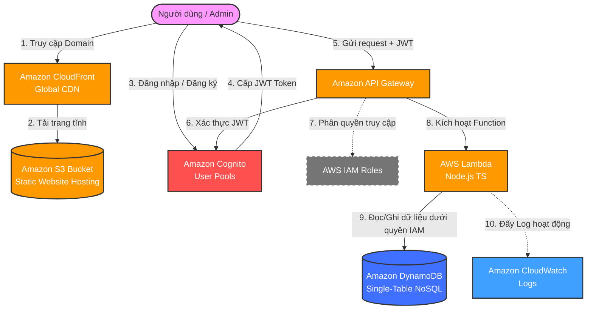

# AWS Serverless Event Management Portal (Enterprise-Grade Standard)

[](https://aws.amazon.com/free/)
[](https://github.com/bmad-code-org/BMAD-METHOD)
[](#)

Chào mừng bạn đến với kho lưu trữ mã nguồn và đặc tả thiết kế của hệ thống **AWS Serverless Event Management Portal** (Cổng thông tin Quản lý và Đăng ký Sự kiện Trực tuyến). 

Hệ thống được thiết kế theo mô hình **Serverless** 100% không máy chủ, sử dụng các dịch vụ lõi của Amazon Web Services (AWS) và được tối ưu hóa cấu hình để **chạy hoàn toàn miễn phí trong gói AWS Free Tier** (Always Free và 12 Months Free).

---

## 🏗️ 1. Sơ Đồ Kiến Trúc Hệ Thống (AWS Serverless Architecture)

Hệ thống vận hành theo cơ chế **Event-Driven Architecture (Kiến trúc hướng sự kiện)**, chỉ tính toán và kích hoạt tài nguyên khi có yêu cầu thực tế từ Client, giúp hóa đơn AWS luôn ở mức 0đ.



---

## 📊 2. Bản Thiết Kế Cơ Sở Dữ Liệu Single-Table Design Đỉnh Cao

Dữ liệu được tổ chức khoa học trong một bảng duy nhất `EventApp-Data` hỗ trợ tới **17 thực thể nghiệp vụ khác nhau** chỉ bằng **2 Chỉ mục phụ (Overloaded GSIs)**:

*   **CQRS Seats Projection:** Khi ghi dữ liệu đặt vé, hệ thống chỉ ghi trực tiếp vào `TICKET`. Tính năng **DynamoDB Streams** tự động kích hoạt Lambda để đồng bộ bất đồng bộ (`Eventual Consistency`) sang trường tổng ghế trống `Event.remainingSeats` giúp tối ưu hóa tối đa hiệu năng đọc/ghi.
*   **Hybrid Audit Timeline:** Ghi log phân tán rộng rãi bằng `PK = LOG#<Component>` chống hot partition, đồng thời gộp dòng thời gian log toàn cục qua `GSI1Index` phục vụ Admin.
*   **Idempotency Key:** Trường `requestId` được tích hợp trong `REGISTRATION` để triệt tiêu lỗi mua trùng vé (double-booking).

---

## 📂 3. Bản Đồ Tài Liệu Kỹ Thuật (docs/)

Toàn bộ tài liệu kỹ thuật của dự án đã được nâng cấp theo chuẩn **AWS Well-Architected Framework** và phương pháp **BMAD-METHOD**. Mời bạn truy cập thư mục `docs/` để xem chi tiết:

- **[INDEX - Chỉ Mục Tài Liệu](./docs/index.md):** Điểm điều hướng trung tâm phân loại theo 5 trụ cột AWS (Security, Reliability, Performance, Cost, Operations).
- **[Tổng Quan Dự Án](./docs/README.md):** Hướng dẫn xử lý các Use Case và giải quyết sự cố thực tế.
- **Tài liệu gốc (Legacy Docs):** Chứa các sơ đồ như [db.md](./db.md) (Sơ Đồ Thực Thể Database) và đặc tả API/hạ tầng.

---

## 🚀 4. Hướng Dẫn Tải Lên GitHub Nhanh Chóng

Thực hiện lần lượt các bước sau để đẩy toàn bộ dự án lên kho lưu trữ GitHub mới của bạn:

### Bước 1: Khởi tạo Git tại máy cục bộ
Mở Terminal tại thư mục `aws-serverless-event-portal` và chạy:
```bash
# Khởi tạo repository cục bộ
git init

# Thêm tất cả tài liệu vào staging area
git add .

# Thực hiện commit đầu tiên
git commit -m "feat: init AWS Serverless Event Portal Technical Design Docs (v1.3)"
```

### Bước 2: Tạo Repo mới trên Github
1.  Truy cập [github.com/new](https://github.com/new).
2.  Đặt tên Repository Name là: `aws-serverless-event-portal`
3.  Phần cấu hình khác (README, gitignore, License) chọn **None / Off** (vì chúng ta đã chuẩn bị sẵn).
4.  Nhấn nút **"Create repository"** màu xanh lá.

### Bước 3: Liên kết và tải lên GitHub
Chạy các dòng lệnh hiển thị trên màn hình GitHub của bạn (thay thế bằng URL repo của bạn):
```bash
# Đổi tên nhánh chính thành main
git branch -M main

# Liên kết với Github repo vừa tạo
git remote add origin https://github.com/hieuwin10/aws-serverless-event-portal.git

# Đẩy code lên GitHub
git push -u origin main
```

---

## 🛠️ 5. Hướng Dẫn Cấu Hình Và Triển Khai (CloudFormation IaC)

Hệ thống hỗ trợ triển khai hoàn toàn tự động lên AWS chỉ trong 3 phút bằng công nghệ **Infrastructure as Code (IaC)**. Mời bạn xem các tài liệu hướng dẫn cấu hình và dọn dẹp chi tiết tại thư mục `huong dan cau hinh/`:

1. **[00-Tong-Quan.md](./huong%20dan%20cau%20hinh/00-Tong-Quan.md):** Tổng quan quy trình triển khai bằng CloudFormation.
2. **[01-Chuan-Bi-Code.md](./huong%20dan%20cau%20hinh/01-Chuan-Bi-Code.md):** Đóng gói mã nguồn Backend.
3. **[02-Trien-Khai-CloudFormation.md](./huong%20dan%20cau%20hinh/02-Trien-Khai-CloudFormation.md):** Nạp bản vẽ `template.yaml` để tự động hóa hạ tầng.
4. **[03-Trien-Khai-Frontend.md](./huong%20dan%20cau%20hinh/03-Trien-Khai-Frontend.md):** Đẩy code Frontend tĩnh lên Amazon S3 Bucket.
5. **[04-Don-Dep-Tai-Nguyen.md](./huong%20dan%20cau%20hinh/04-Don-Dep-Tai-Nguyen.md):** Hướng dẫn xóa sạch các dịch vụ AWS sau khi test để tránh phát sinh chi phí.

---
*Tài liệu được biên soạn dựa trên tiêu chuẩn kiến trúc BMAD Method v6 (Breakthrough Method for Agile AI-Driven Development).*
