# Tài Liệu AWS Well-Architected Framework

> **Dự án**: AWS Serverless Event Portal  
> **Phiên bản tài liệu**: 2.0  
> **Cập nhật**: 12/06/2026

Chào mừng đến với hệ thống tài liệu đánh giá và cải thiện kiến trúc AWS Serverless theo tiêu chuẩn **AWS Well-Architected Framework**. Tài liệu được tổ chức theo phương pháp **BMAD-METHOD** với 4 loại tài liệu chuyên biệt.

---

## 🎯 Mục Đích

Hệ thống tài liệu này cung cấp:
- **Đánh giá toàn diện** kiến trúc hiện tại theo 5 trụ cột Well-Architected
- **Hướng dẫn cải thiện** cụ thể với code examples có thể triển khai ngay
- **Best practices** cho Security, Reliability, Performance, Cost, Operations
- **Tối ưu hóa Free Tier** để giảm chi phí tối đa

---

## 📁 Cấu Trúc Thư Mục (BMAD-METHOD)

```mermaid
graph TD
    DOCS[docs/]

    DOCS --> SEC[security/]
    DOCS --> OPS[operations/]
    DOCS --> ARCH[architecture/]
    DOCS --> INFRA[infrastructure/]
    DOCS --> TEST[testing/]

    SEC --> SEC_TUT[tutorials/]
    SEC --> SEC_HOW[how-to/]
    SEC --> SEC_EXP[explanation/]
    SEC --> SEC_REF[reference/]

    SEC_HOW --> SH1[security-hardening.md ✅]
    SEC_HOW --> SH2[waf-configuration.md ✅]
    SEC_HOW --> SH3[cognito-advanced.md ✅]
    SEC_REF --> SR1[iam-policies.md ✅]

    OPS --> OPS_HOW[how-to/]
    OPS --> OPS_REF[reference/]
    OPS_HOW --> OH1[monitoring-alerting.md ✅]
    OPS_HOW --> OH2[backup-recovery.md ✅]
    OPS_HOW --> OH3[cost-optimization.md ✅]
    OPS_REF --> OR1[runbooks.md ✅]

    ARCH --> ARCH_EXP[explanation/]
    ARCH --> ARCH_REF[reference/]
    ARCH_EXP --> AE1[scalability-design.md ✅]
    ARCH_REF --> AR1[architecture-decisions.md ✅]

    INFRA --> INFRA_HOW[how-to/]
    INFRA --> INFRA_REF[reference/]
    INFRA_HOW --> IH1[cicd-pipeline.md ✅]
    INFRA_REF --> IR1[cloudformation-templates.md ✅]

    TEST --> TEST_HOW[how-to/]
    TEST_HOW --> TH1[load-testing.md ✅]
    TEST_HOW --> TH2[security-testing.md ✅]
    TEST_HOW --> TH3[chaos-engineering.md ✅]

    style DOCS fill:#1a1a2e,color:#fff
    style SEC fill:#16213e,color:#e94560
    style OPS fill:#16213e,color:#0f9b8e
    style ARCH fill:#16213e,color:#533483
    style INFRA fill:#16213e,color:#e2b04a
    style TEST fill:#16213e,color:#2196f3
```

---

## 🗺️ Navigation Guide — Chọn Đúng Tài Liệu

```mermaid
flowchart TD
    START([Bạn cần gì?]) --> Q1{Vấn đề bảo mật?}
    START --> Q2{Vấn đề performance?}
    START --> Q3{Vấn đề chi phí?}
    START --> Q4{Vấn đề vận hành?}
    START --> Q5{Kiểm thử hệ thống?}

    Q1 -->|IAM/Policies| IAM[iam-policies.md]
    Q1 -->|WAF/DDoS| WAF[waf-configuration.md]
    Q1 -->|Security tổng thể| HARD[security-hardening.md]
    Q1 -->|Cognito/Auth| COG[cognito-advanced.md]

    Q2 -->|Scaling DynamoDB/Lambda| SCALE[scalability-design.md]
    Q2 -->|Giải thích kiến trúc| ADR[architecture-decisions.md]
    Q2 -->|CloudFormation templates| CFN[cloudformation-templates.md]

    Q3 -->|Billing alerts, right-sizing| COST[cost-optimization.md]
    Q3 -->|Backup và DR| BACKUP[backup-recovery.md]

    Q4 -->|Monitoring & Alerts| MON[monitoring-alerting.md]
    Q4 -->|Incident response| RUN[runbooks.md]
    Q4 -->|CI/CD Pipeline| CICD[cicd-pipeline.md]

    Q5 -->|Load testing| LOAD[load-testing.md]
    Q5 -->|Security testing| SECTEST[security-testing.md]
    Q5 -->|Chaos engineering| CHAOS[chaos-engineering.md]

    style START fill:#e94560,color:#fff
    style Q1 fill:#16213e,color:#e94560
    style Q2 fill:#16213e,color:#533483
    style Q3 fill:#16213e,color:#0f9b8e
    style Q4 fill:#16213e,color:#e2b04a
    style Q5 fill:#16213e,color:#2196f3
```

---

## 🚀 Quick Start — Bắt Đầu Theo Use Case

### 🔒 Cải thiện bảo mật ngay
1. Đọc [Well-Architected Assessment](./well-architected-assessment.md) → xác định rủi ro
2. Ưu tiên 1 (5 phút): Bật [S3 Block Public Access](./security/how-to/security-hardening.md)
3. Ưu tiên 2 (2 giờ): Cấu hình [Cognito MFA](./security/how-to/cognito-advanced.md)
4. Ưu tiên 3 (1 ngày): Áp dụng [IAM Least Privilege](./security/reference/iam-policies.md)

### 💰 Giảm chi phí
1. Tạo [Billing Alarm](./operations/how-to/cost-optimization.md#1-thiết-lập-aws-billing-alerts) ngay
2. Set [CloudWatch Log Retention](./operations/how-to/cost-optimization.md) 7 ngày
3. Chuyển DynamoDB sang [On-Demand mode](./architecture/explanation/scalability-design.md)

### 📈 Tăng khả năng mở rộng
1. Đọc [Scalability Design](./architecture/explanation/scalability-design.md)
2. Bật [DynamoDB Auto Scaling](./architecture/explanation/scalability-design.md)
3. Deploy [CloudFormation templates](./infrastructure/reference/cloudformation-templates.md)

### 🔍 Thiết lập monitoring
1. Cài đặt [CloudWatch Alarms và Dashboard](./operations/how-to/monitoring-alerting.md)
2. Tạo [Runbooks](./operations/reference/runbooks.md) cho incident response
3. Thiết lập [CI/CD Pipeline](./infrastructure/how-to/cicd-pipeline.md)

### 🧪 Kiểm thử hệ thống
1. Chạy [Load Testing](./testing/how-to/load-testing.md) với Artillery/k6
2. Thực hiện [Security Testing](./testing/how-to/security-testing.md) với OWASP ZAP
3. Tổ chức [Chaos Engineering](./testing/how-to/chaos-engineering.md) với AWS FIS

---

## 📊 AWS Well-Architected Assessment — Tóm Tắt

| Trụ Cột | Risk | High Issues | Chi Tiết |
|---------|------|-------------|----------|
| 🔴 Security | **HIGH** | 5 | [well-architected-assessment.md#security](./well-architected-assessment.md) |
| 🟡 Reliability | **MEDIUM** | 3 | [well-architected-assessment.md#reliability](./well-architected-assessment.md) |
| 🟡 Performance | **MEDIUM** | 2 | [well-architected-assessment.md#performance](./well-architected-assessment.md) |
| 🟡 Cost | **MEDIUM** | 2 | [well-architected-assessment.md#cost](./well-architected-assessment.md) |
| 🟠 Operations | **HIGH** | 3 | [well-architected-assessment.md#operations](./well-architected-assessment.md) |

→ Xem đầy đủ: **[Well-Architected Assessment Report](./well-architected-assessment.md)**

---

## 📚 Danh Sách Tất Cả Tài Liệu

### Security (Bảo Mật)

| Loại | File | Mô Tả |
|------|------|--------|
| How-To | [security-hardening.md](./security/how-to/security-hardening.md) | Hardening S3, CloudFront, Lambda security headers |
| How-To | [waf-configuration.md](./security/how-to/waf-configuration.md) | Cấu hình AWS WAF với rate limiting rules |
| How-To | [cognito-advanced.md](./security/how-to/cognito-advanced.md) | MFA, advanced Cognito config, Lambda triggers |
| Reference | [iam-policies.md](./security/reference/iam-policies.md) | Least Privilege IAM policies cho mọi service |

### Operations (Vận Hành)

| Loại | File | Mô Tả |
|------|------|--------|
| How-To | [monitoring-alerting.md](./operations/how-to/monitoring-alerting.md) | CloudWatch Alarms, Dashboard, SNS alerts |
| How-To | [backup-recovery.md](./operations/how-to/backup-recovery.md) | DynamoDB PITR, S3 versioning, DR plan |
| How-To | [cost-optimization.md](./operations/how-to/cost-optimization.md) | Billing alerts, right-sizing, Free Tier tips |
| Reference | [runbooks.md](./operations/reference/runbooks.md) | Incident response runbooks cho 5 scenarios |

### Architecture (Kiến Trúc)

| Loại | File | Mô Tả |
|------|------|--------|
| Explanation | [scalability-design.md](./architecture/explanation/scalability-design.md) | DynamoDB auto-scaling, Lambda cold start, throttling |
| Reference | [architecture-decisions.md](./architecture/reference/architecture-decisions.md) | ADRs: DynamoDB vs RDS, Lambda vs EC2, Cognito vs custom |

### Infrastructure (Hạ Tầng)

| Loại | File | Mô Tả |
|------|------|--------|
| How-To | [cicd-pipeline.md](./infrastructure/how-to/cicd-pipeline.md) | GitHub Actions: security scan, testing, blue-green deploy |
| Reference | [cloudformation-templates.md](./infrastructure/reference/cloudformation-templates.md) | CloudFormation/SAM templates cho WAF, scaling, monitoring |

### Testing (Kiểm Thử)

| Loại | File | Mô Tả |
|------|------|--------|
| How-To | [load-testing.md](./testing/how-to/load-testing.md) | Artillery & k6 load test scripts, phân tích kết quả |
| How-To | [security-testing.md](./testing/how-to/security-testing.md) | OWASP ZAP, IAM policy testing, penetration testing |
| How-To | [chaos-engineering.md](./testing/how-to/chaos-engineering.md) | AWS FIS experiments: Lambda, DynamoDB, API Gateway |

---

## 🆚 Sự Khác Biệt: Tài Liệu Cũ vs Mới

| | Tài Liệu Cũ (`docs/*.md`) | Tài Liệu Well-Architected (`docs/*/`) |
|---|---------------------------|----------------------------------------|
| **Mục tiêu** | Project overview, setup guide | Security hardening, production readiness |
| **Phương pháp** | Technical documentation | BMAD-METHOD (tutorials/how-to/explanation/reference) |
| **Nội dung** | Kiến trúc hệ thống, API contracts | AWS Well-Architected best practices |
| **Code examples** | Setup và development | Production-ready, deployable ngay |
| **Free Tier** | Mention chung | Warnings rõ ràng với cost estimation |
| **Audience** | Developers | DevOps, Security, Architecture teams |

### Tài Liệu Cũ (Technical Reference)
- [index.md](./index.md) — Chỉ mục tài liệu gốc
- [project-overview.md](./project-overview.md) — Tổng quan dự án
- [architecture-backend.md](./architecture-backend.md) — Kiến trúc Lambda/API
- [architecture-frontend.md](./architecture-frontend.md) — Kiến trúc React/S3
- [data-models.md](./data-models.md) — DynamoDB Single-Table Design
- [api-contracts.md](./api-contracts.md) — API Gateway endpoints
- [infrastructure-as-code.md](./infrastructure-as-code.md) — SAM template.yaml
- [development-guide.md](./development-guide.md) — Setup guide
- [testing-strategy.md](./testing-strategy.md) — Test pyramid

---

## 🆓 Free Tier Quick Reference

| Service | Free Tier | Khi Nào Tốn Tiền |
|---------|-----------|------------------|
| Lambda | 1M req/month, 400K GB-sec | Vượt quota hoặc Provisioned Concurrency |
| DynamoDB | 25 GB, 25 RCU/WCU | On-Demand mode với traffic cao |
| CloudWatch | 10 alarms, 5 GB logs | Log storage sau 5 GB, custom metrics |
| S3 | 5 GB, 20K GET | Storage và transfer sau quota |
| Cognito | 50K MAU | Vượt 50K monthly active users |
| ⚠️ WAF | **KHÔNG** có Free Tier | $5/month + $1/rule — **TRÁNH trên dev** |

---

## 📞 Hỗ Trợ

1. Xem [Well-Architected Assessment](./well-architected-assessment.md) để biết vấn đề ưu tiên
2. Dùng [INDEX.md](./INDEX.md) để tìm tài liệu theo category
3. Tham khảo [AWS Well-Architected Tool](https://console.aws.amazon.com/wellarchitected/) (miễn phí)

---

*Tài liệu này tuân theo phương pháp BMAD-METHOD và AWS Well-Architected Framework. Cập nhật: 12/06/2026.*

---

**Metadata**:
- **Requirements**: Requirement 1, Requirement 15, Requirement 16
