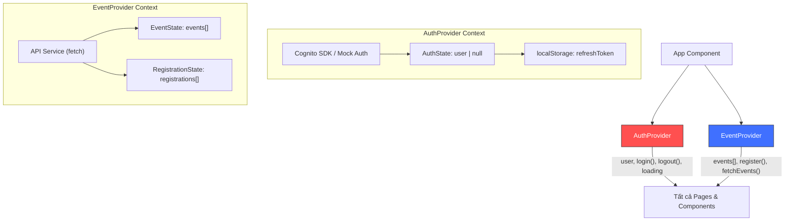

# Kiến Trúc Giao Diện (Architecture Frontend)

Tài liệu này cung cấp thiết kế kiến trúc chi tiết cho cấu phần **Frontend** của dự án Website Quản Lý và Đăng Ký Sự Kiện Online. Mục tiêu chính là xây dựng một giao diện **Web App Premium** với tốc độ tải trang tức thời, bố cục phản hồi mượt mà (Responsive), sử dụng **React + Vite** và phong cách thiết kế **Theme tối sang trọng (Sleek Dark Mode & Glassmorphism)** bằng **Vanilla CSS**.

---

## 1. Kiến Trúc Ứng Dụng React + Vite

Chúng tôi chọn **Vite** làm công cụ đóng gói (bundler) thay vì Create React App truyền thống nhằm tối ưu hóa tốc độ khởi động môi trường dev cục bộ và tốc độ đóng gói tối đa.

### Sơ Đồ Cấu Trúc Thành Phần Giao Diện (Component Hierarchy)

```
App (Root Component)
 ├── AuthProvider (Quản lý trạng thái Cognito Token & User Profile)
 ├── EventProvider (Quản lý danh sách sự kiện & Lượt đăng ký)
 └── AppRoutes (Quản lý định tuyến)
      ├── Layout (Bố cục chung: Header, Footer, Background động)
      │    ├── Trang chủ (Event Catalog with Search & Category Filters)
      │    ├── Chi tiết sự kiện (Event Details with Tickets Remaining Meter)
      │    ├── Trang cá nhân (User Dashboard - Registered Events)
      │    ├── Đăng nhập / Đăng ký (Auth Forms with Elegant Feedback)
      │    └── [PROTECTED] Admin Panel (Event Creator, Member List, Stats)
```

---

## 2. Hệ Thống Thiết Kế Tùy Biến (Design System)

Để tạo nên một giao diện sang trọng chuẩn "Premium" và tránh thiết kế đơn điệu, chúng tôi xây dựng một **Design System** vững chắc tại tệp `index.css` sử dụng các biến CSS (**CSS Variables**). Màu sắc chủ đạo được tùy chỉnh theo hệ màu **HSL** hài hòa:

### Các Biến Token CSS Cốt Lõi (`index.css`)

```css
:root {
  /* Google Fonts */
  --font-primary: 'Outfit', 'Inter', sans-serif;

  /* Bảng màu HSL tối thượng */
  --bg-primary: HSL(220, 25%, 7%);       /* Xanh xám vũ trụ rất tối */
  --bg-secondary: HSL(220, 22%, 13%);     /* Xanh xám nhạt hơn làm card */
  --text-primary: HSL(0, 0%, 95%);        /* Trắng ấm dễ chịu */
  --text-secondary: HSL(220, 10%, 65%);   /* Xám bạc cho phụ đề */
  
  /* Màu nhấn (Accent Colors) đại diện cho AWS */
  --color-primary: HSL(32, 100%, 50%);    /* Cam AWS rực rỡ */
  --color-primary-hover: HSL(32, 100%, 45%);
  --color-accent: HSL(200, 100%, 50%);     /* Xanh dương Cognito bảo mật */
  --color-success: HSL(145, 80%, 45%);    /* Xanh lá đăng ký thành công */
  --color-error: HSL(355, 85%, 55%);      /* Đỏ báo lỗi */

  /* Thiết kế kính mờ (Glassmorphism) */
  --glass-bg: rgba(22, 28, 45, 0.45);
  --glass-border: rgba(255, 255, 255, 0.08);
  --glass-shadow: rgba(0, 0, 0, 0.3);
  --glass-backdrop-filter: blur(12px) saturate(180%);

  /* Bo góc & Bóng đổ chuyên nghiệp */
  --radius-sm: 8px;
  --radius-md: 16px;
  --radius-lg: 24px;
  --transition-smooth: all 0.3s cubic-bezier(0.4, 0, 0.2, 1);
}
```

### Phong Cách Giao Diện Chủ Đạo:
1.  **Hiệu ứng Glassmorphism:** Các khối hiển thị nội dung (Card, Form, Modal) sử dụng hiệu ứng gương kính sang trọng với bộ lọc làm mờ hậu cảnh (`backdrop-filter: blur()`).
2.  **Độ tương phản cao & Font cao cấp:** Sử dụng font chữ **Outfit** của Google Fonts cho các thẻ tiêu đề (`h1`, `h2`) tạo cảm giác hiện đại và **Inter** cho các văn bản nội dung đảm bảo tính dễ đọc tuyệt đối.
3.  **Micro-animations:**
    *   **Nút nhấn (Buttons):** Khi hover sẽ có hiệu ứng ánh sáng chạy qua (`shine effect`) kết hợp thu phóng nhẹ (`transform: scale(1.02)`).
    *   **Thẻ sự kiện (Event Cards):** Khi di chuột vào sẽ nâng cao nhẹ và phát sáng viền thông qua đổi màu border HSL.

---

## 3. Hệ Thống Định Tuyến & Bảo Vệ Route (Routing & Protection)

Hệ thống sử dụng **React Router DOM** để chuyển trang. Để ngăn ngừa việc người dùng phổ thông truy cập vào trang Admin gây lỗi, chúng tôi thiết lập cơ chế **Route Guard**:

```
[Người dùng truy cập /admin]
        │
        ▼
[Kiểm tra AuthState trong AuthProvider]
        │
        ├─► [Chưa đăng nhập?] ───────► Điều hướng sang /login
        │
        ├─► [Đã đăng nhập nhưng không phải Admin?] ──► Hiển thị trang 403 Forbidden
        │
        └─► [Đã đăng nhập với tư cách Admin] ───────► Cho phép truy cập Admin Dashboard
```

### Cấu Trúc File Định Tuyến Minh Họa (`frontend/src/routes/ProtectedRoute.tsx`)
```typescript
import React from 'react';
import { Navigate } from 'react-router-dom';
import { useAuth } from '../context/AuthContext';

interface ProtectedRouteProps {
  children: React.ReactNode;
  requireAdmin?: boolean;
}

export const ProtectedRoute: React.FC<ProtectedRouteProps> = ({ 
  children, 
  requireAdmin = false 
}) => {
  const { user, loading } = useAuth();

  if (loading) {
    return <div className="loading-spinner-container">Loading...</div>;
  }

  if (!user) {
    return <Navigate to="/login" replace />;
  }

  if (requireAdmin && user.role !== 'Admin') {
    return <Navigate to="/unauthorized" replace />;
  }

  return <>{children}</>;
};
```

---

## 4. Quản Lý Trạng Thái Xác Thực (Cognito JWT Integration)

Khi tích hợp với **Amazon Cognito User Pools**:
*   Sau khi đăng nhập thành công, Cognito sẽ trả về 3 loại token: `IdToken`, `AccessToken`, và `RefreshToken`.
*   **IdToken** (chứa thông tin người dùng như `email`, `name`, `cognito:groups` tức phân quyền Admin).
*   Các token được lưu trữ tạm thời trong bộ nhớ ứng dụng (`React State`) hoặc Cookie bảo mật (`HTTP-Only` thông qua API Gateway) và một mã token tham chiếu ngắn được lưu tại `localStorage` để tự động làm mới phiên làm việc bằng `RefreshToken` khi F5 trang.

---

## 5. Tương Thích Thiết Bị (Responsive Layout Grid)

Giao diện áp dụng thiết kế **Mobile-First** sử dụng CSS Flexbox và CSS Grid.
*   **Mobile (< 768px):** Bố cục 1 cột tối giản, Header thu gọn thành menu Hamburger.
*   **Tablet (768px - 1024px):** Bố cục lưới sự kiện 2 cột, tối ưu khoảng cách đệm.
*   **Desktop (> 1024px):** Bố cục lưới sự kiện 3 hoặc 4 cột, thanh công cụ tìm kiếm nằm ngang tinh gọn.
*   Mọi tương tác chạm (Touch Events) trên di động được bổ sung độ trễ phản hồi cực thấp cùng kích thước nút tối thiểu **44px x 44px** tuân thủ quy chuẩn trải nghiệm người dùng iOS/Android.

---

## 6. Quản Lý Trạng Thái Chi Tiết (State Management Deep-Dive)

Ứng dụng sử dụng **React Context API** thay vì thư viện quản lý trạng thái bên ngoài (như Redux hay Zustand) để giảm thiểu kích thước bundle và giữ cho kiến trúc đơn giản phù hợp với quy mô dự án.

### 6.1. Sơ Đồ Luồng Dữ Liệu (Data Flow Diagram)



### 6.2. AuthContext — Chi tiết Interface

```typescript
// frontend/src/context/AuthContext.tsx
interface User {
  id: string;          // Cognito sub (UUID)
  email: string;
  name: string;
  role: 'User' | 'Admin';  // Từ cognito:groups
}

interface AuthContextType {
  user: User | null;         // null = chưa đăng nhập
  loading: boolean;          // true khi đang kiểm tra token ban đầu
  login: (email: string, password: string) => Promise<void>;
  register: (email: string, password: string, name: string) => Promise<void>;
  confirmOTP: (email: string, code: string) => Promise<void>;
  logout: () => void;
  refreshSession: () => Promise<void>;  // Tự động làm mới JWT Token
}
```

### 6.3. EventContext — Chi tiết Interface

```typescript
// frontend/src/context/EventContext.tsx
interface Event {
  id: string;
  title: string;
  category: string;
  description: string;
  date: string;
  location: string;
  imageUrl: string;
  totalSeats: number;
  registeredCount: number;
}

interface EventContextType {
  events: Event[];
  loading: boolean;
  error: string | null;
  fetchEvents: (filters?: { category?: string; search?: string }) => Promise<void>;
  getEventById: (id: string) => Promise<Event | null>;
  registerForEvent: (eventId: string) => Promise<void>;
  // Admin-only
  createEvent: (data: Omit<Event, 'id' | 'registeredCount'>) => Promise<void>;
  updateEvent: (id: string, data: Partial<Event>) => Promise<void>;
  deleteEvent: (id: string) => Promise<void>;
}
```

### 6.4. Quy Tắc Quản Lý State

1. **Không truyền Props xuyên tầng (Prop Drilling):** Mọi dữ liệu chia sẻ đều đi qua Context.
2. **Tách biệt quan tâm:** `AuthContext` chỉ xử lý đăng nhập/đăng xuất, `EventContext` chỉ xử lý CRUD sự kiện.
3. **Optimistic UI:** Khi người dùng bấm "Đăng ký", giao diện cập nhật `registeredCount + 1` ngay lập tức trước khi API trả kết quả, nếu API lỗi thì rollback.

