# Vận Hành, Sao Lưu & CI/CD Pipeline (Operations, Backup & CI/CD)

Tài liệu này bổ sung chiến lược vận hành thực tế cho dự án, bao gồm **Sao lưu & Khôi phục dữ liệu (Backup & Disaster Recovery)** và **Tự động hóa quy trình triển khai (CI/CD)** thông qua **GitHub Actions** — giúp mỗi lần push code lên GitHub, hệ thống sẽ tự động build, test và deploy lên AWS mà không cần thao tác thủ công.

---

## 1. Sao Lưu & Khôi Phục Dữ Liệu (Backup & Disaster Recovery)

### 1.1. Vì sao cần Backup dù là Free Tier?
Dù bạn đang dùng Free Tier với dữ liệu nhỏ, nhưng nếu vô tình xóa bảng DynamoDB hoặc sửa nhầm dữ liệu hàng loạt, toàn bộ thông tin sự kiện và danh sách đăng ký sẽ mất vĩnh viễn. Một chiến lược sao lưu đơn giản sẽ bảo vệ bạn khỏi những rủi ro này.

### 1.2. Các phương án Backup

| Phương án | Chi phí | Mức bảo vệ | Phù hợp khi nào |
| :--- | :--- | :--- | :--- |
| **On-Demand Backup** (Thủ công) | Miễn phí (lưu trữ có phí nhỏ ~$0.10/GB/tháng) | Tạo bản snapshot tại 1 thời điểm | Trước mỗi lần thay đổi lớn (migration) |
| **Point-in-Time Recovery (PITR)** | ~$0.20/GB/tháng | Khôi phục về bất kỳ giây nào trong 35 ngày gần nhất | Dự án production cần bảo vệ cao nhất |
| **Export to S3** (Xuất định kỳ) | Miễn phí (nếu S3 < 5GB) | Tạo bản sao dạng JSON lưu trên S3 | Lưu trữ dài hạn, phân tích dữ liệu |

### 1.3. Hướng dẫn tạo On-Demand Backup (Khuyên dùng cho Free Tier)

```bash
# Tạo bản sao lưu thủ công trước khi deploy phiên bản mới
aws dynamodb create-backup \
  --table-name EventApp-Data \
  --backup-name EventApp-Backup-$(date +%Y%m%d)

# Liệt kê các bản sao lưu đã tạo
aws dynamodb list-backups --table-name EventApp-Data

# Khôi phục bảng từ bản sao lưu (tạo bảng mới từ backup)
aws dynamodb restore-table-from-backup \
  --target-table-name EventApp-Data-Restored \
  --backup-arn arn:aws:dynamodb:ap-southeast-1:ACCOUNT:table/EventApp-Data/backup/BACKUP_ID
```

### 1.4. Export dữ liệu định kỳ bằng Script

Để xuất toàn bộ dữ liệu ra tệp JSON lưu trên máy cục bộ hoặc S3:

```bash
# Xuất toàn bộ bảng ra file JSON
aws dynamodb scan \
  --table-name EventApp-Data \
  --output json > backup-eventapp-$(date +%Y%m%d).json
```

> 💡 **MẸO:** Có thể lên lịch chạy script này hàng tuần bằng **GitHub Actions Cron** (xem phần CI/CD bên dưới) để tự động backup mà không cần nhớ.

---

## 2. CI/CD Pipeline với GitHub Actions

### 2.1. Tổng quan luồng tự động hóa

```mermaid
graph LR
    Dev([Lập trình viên]) -->|git push| GH[GitHub Repository]
    GH -->|Trigger Workflow| GA[GitHub Actions]
    
    GA -->|1. Install & Lint| Lint[Kiểm tra code style]
    Lint -->|2. Run Tests| Test[Unit Test + Integration Test]
    Test -->|3. Build Frontend| BuildFE[npm run build]
    Test -->|4. Build Backend| BuildBE[TypeScript compile]
    
    BuildFE -->|5. Deploy to S3| S3[(Amazon S3)]
    BuildBE -->|6. Deploy Lambda| Lambda[AWS Lambda]
    S3 -->|7. Invalidate Cache| CF[CloudFront]
    
    style Dev fill:#f9f,stroke:#333,stroke-width:2px
    style GA fill:#2088FF,stroke:#333,stroke-width:2px,color:#fff
    style S3 fill:#ff9900,stroke:#333,stroke-width:2px,color:#fff
    style Lambda fill:#ff9900,stroke:#333,stroke-width:2px,color:#fff
    style CF fill:#ff9900,stroke:#333,stroke-width:2px,color:#fff
```



### 2.2. Cấu hình GitHub Actions Workflow

Tạo tệp `.github/workflows/deploy.yml` tại thư mục gốc dự án:

```yaml
name: Deploy EventApp to AWS

on:
  push:
    branches: [main]
  pull_request:
    branches: [main]

env:
  AWS_REGION: ap-southeast-1
  S3_BUCKET: eventapp-frontend-bucket
  CLOUDFRONT_DISTRIBUTION_ID: ${{ secrets.CLOUDFRONT_DISTRIBUTION_ID }}

jobs:
  # ============================================
  # JOB 1: Kiểm thử toàn diện
  # ============================================
  test:
    name: Lint & Test
    runs-on: ubuntu-latest
    steps:
      - uses: actions/checkout@v4

      - name: Setup Node.js
        uses: actions/setup-node@v4
        with:
          node-version: 20
          cache: npm

      - name: Install Dependencies
        run: npm run setup

      - name: Lint Frontend
        run: cd frontend && npm run lint

      - name: Unit Test Frontend
        run: cd frontend && npm test -- --run

      - name: Unit Test Backend
        run: cd backend && npm test

  # ============================================
  # JOB 2: Deploy Frontend lên S3 + CloudFront
  # ============================================
  deploy-frontend:
    name: Deploy Frontend
    needs: test
    if: github.ref == 'refs/heads/main' && github.event_name == 'push'
    runs-on: ubuntu-latest
    steps:
      - uses: actions/checkout@v4

      - name: Setup Node.js
        uses: actions/setup-node@v4
        with:
          node-version: 20
          cache: npm

      - name: Install & Build Frontend
        run: |
          cd frontend
          npm ci
          npm run build

      - name: Configure AWS Credentials
        uses: aws-actions/configure-aws-credentials@v4
        with:
          aws-access-key-id: ${{ secrets.AWS_ACCESS_KEY_ID }}
          aws-secret-access-key: ${{ secrets.AWS_SECRET_ACCESS_KEY }}
          aws-region: ${{ env.AWS_REGION }}

      - name: Sync to S3
        run: |
          aws s3 sync frontend/dist/ s3://${{ env.S3_BUCKET }} \
            --delete \
            --cache-control "public,max-age=31536000,immutable" \
            --exclude "index.html"
          # index.html cần cache ngắn để luôn lấy phiên bản mới nhất
          aws s3 cp frontend/dist/index.html s3://${{ env.S3_BUCKET }}/index.html \
            --cache-control "public,max-age=0,must-revalidate"

      - name: Invalidate CloudFront Cache
        run: |
          aws cloudfront create-invalidation \
            --distribution-id ${{ env.CLOUDFRONT_DISTRIBUTION_ID }} \
            --paths "/*"

  # ============================================
  # JOB 3: Deploy Backend Lambda qua SAM
  # ============================================
  deploy-backend:
    name: Deploy Backend (SAM)
    needs: test
    if: github.ref == 'refs/heads/main' && github.event_name == 'push'
    runs-on: ubuntu-latest
    steps:
      - uses: actions/checkout@v4

      - name: Setup Node.js
        uses: actions/setup-node@v4
        with:
          node-version: 20
          cache: npm

      - name: Install & Build Backend
        run: |
          cd backend
          npm ci
          npm run build

      - name: Setup SAM CLI
        uses: aws-actions/setup-sam@v2

      - name: Configure AWS Credentials
        uses: aws-actions/configure-aws-credentials@v4
        with:
          aws-access-key-id: ${{ secrets.AWS_ACCESS_KEY_ID }}
          aws-secret-access-key: ${{ secrets.AWS_SECRET_ACCESS_KEY }}
          aws-region: ${{ env.AWS_REGION }}

      - name: SAM Build & Deploy
        run: |
          cd backend
          sam build
          sam deploy --no-confirm-changeset --no-fail-on-empty-changeset
```

### 2.3. Thiết lập GitHub Secrets

Trước khi GitHub Actions có thể deploy lên AWS, bạn cần cấu hình các biến bí mật (Secrets) trong repository GitHub:

1.  Truy cập **GitHub Repository → Settings → Secrets and variables → Actions**.
2.  Thêm các secrets sau:

| Secret Name | Giá trị | Lấy từ đâu |
| :--- | :--- | :--- |
| `AWS_ACCESS_KEY_ID` | Access Key của IAM User deploy | AWS Console → IAM → Users → Security Credentials |
| `AWS_SECRET_ACCESS_KEY` | Secret Key tương ứng | Cùng vị trí trên (chỉ hiển thị 1 lần khi tạo) |
| `CLOUDFRONT_DISTRIBUTION_ID` | ID của CloudFront Distribution | AWS Console → CloudFront → Distributions |

> ⚠️ **BẢO MẬT:** Tạo một **IAM User riêng biệt** cho CI/CD (ví dụ: `github-actions-deployer`) với quyền tối thiểu chỉ đủ để deploy S3, Lambda và CloudFront. Tuyệt đối không sử dụng tài khoản Root hoặc Admin chính.

### 2.4. Luồng hoạt động khi Developer push code

```
1. Developer hoàn thành tính năng → git push origin main
2. GitHub Actions tự động kích hoạt workflow
3. Job "test" chạy:
   ├── Cài đặt dependencies
   ├── Lint kiểm tra code style
   └── Chạy toàn bộ Unit Tests (Frontend + Backend)
4. Nếu tất cả test PASS:
   ├── Job "deploy-frontend" đồng bộ bản build mới lên S3 → Xóa cache CloudFront
   └── Job "deploy-backend" build SAM → Deploy Lambda functions mới lên AWS
5. Trong vòng 2-5 phút, website production đã được cập nhật tự động!
```

---

## 3. Giám Sát Sau Khi Deploy (Post-Deployment Monitoring)

Sau mỗi lần deploy thành công, hãy kiểm tra nhanh các chỉ số sau trên **CloudWatch Dashboard**:

1.  **Lambda Errors:** Số lượng lỗi trong 5 phút gần nhất phải bằng 0.
2.  **Lambda Duration:** Thời gian xử lý trung bình phải dưới 500ms.
3.  **API Gateway 4xx/5xx:** Tỷ lệ lỗi phải dưới 1%.
4.  **DynamoDB ConsumedReadCapacityUnits / ConsumedWriteCapacityUnits:** Phải dưới mức 25 đã cấu hình.

> 💡 **MẸO NHỎ:** Bạn có thể cấu hình **CloudWatch Alarm** gửi email khi Lambda Error Count > 0 trong 5 phút liên tục. Tính năng này miễn phí (10 alarms trong Free Tier).
