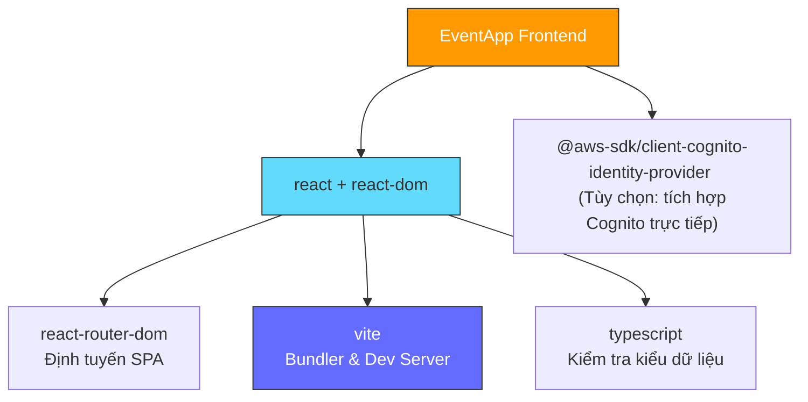
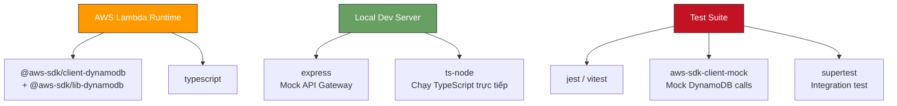

# Phân Tích Cấu Trúc Thư Mục (Source Tree Analysis)

Tài liệu này phân tích chi tiết sơ đồ thư mục của dự án Monorepo **Online Event Management and Registration Website**. Cấu trúc thư mục được thiết kế khoa học, tách biệt rõ ràng phần giao diện (**frontend**) và mã nguồn chạy serverless (**backend**) để thuận tiện cho việc phát triển và tự động hóa CI/CD.

---

## 1. Bản Đồ Cấu Trúc Thư Mục Tổng Thể

Dưới đây là sơ đồ tổ chức mã nguồn trong kho lưu trữ của dự án:

```
Demo/ (Root Workspace)
 ├── frontend/                    # Mã nguồn Frontend (React + Vite)
 │    ├── public/                 # Các tài nguyên tĩnh công khai (logo, favicon)
 │    ├── src/
 │    │    ├── assets/            # CSS toàn cục, font chữ, hình ảnh thiết kế
 │    │    ├── components/        # Thành phần UI dùng chung (Header, Card, Modal)
 │    │    ├── context/           # Trạng thái toàn cục (AuthContext, EventContext)
 │    │    ├── pages/             # Các trang giao diện chính
 │    │    │    ├── Homepage.tsx  # Trang chủ (Danh mục, tìm kiếm sự kiện)
 │    │    │    ├── EventDetail.tsx # Chi tiết sự kiện & Đăng ký
 │    │    │    ├── Login.tsx     # Đăng nhập & Đăng ký
 │    │    │    └── AdminPanel.tsx # Quản lý sự kiện dành cho Admin
 │    │    ├── services/          # Giao tiếp với API Mock / AWS Client
 │    │    ├── routes/            # Hệ thống định tuyến & Route Guard
 │    │    ├── App.tsx            # Thành phần React gốc
 │    │    └── main.tsx           # Entry point của React + Vite
 │    ├── index.html              # Trang HTML chính của ứng dụng
 │    ├── package.json            # Quản lý dependencies của Frontend
 │    ├── tsconfig.json           # Cấu hình TypeScript cho Frontend
 │    └── vite.config.ts          # Cấu hình đóng gói Vite
 │
 ├── backend/                     # Mã nguồn Backend (AWS Lambda TS)
 │    ├── src/
 │    │    ├── handlers/          # Hàm xử lý nghiệp vụ AWS Lambda
 │    │    │    ├── getEvents.ts
 │    │    │    ├── getEventById.ts
 │    │    │    ├── createEvent.ts
 │    │    │    ├── updateEvent.ts
 │    │    │    ├── deleteEvent.ts
 │    │    │    ├── registerEvent.ts
 │    │    │    └── getUserRegistrations.ts
 │    │    ├── services/          # Tầng giao tiếp Database & Auth
 │    │    │    └── dbService.ts  # Tương tác DynamoDB SDK
 │    │    ├── utils/             # Tiện ích bổ trợ (CORS, Logger)
 │    │    └── localServer.ts     # Máy chủ Express giả lập API Gateway chạy offline
 │    ├── package.json            # Quản lý dependencies của Backend
 │    ├── tsconfig.json           # Cấu hình TypeScript cho Backend
 │    ├── webpack.config.js       # (Tùy chọn) Cấu hình đóng gói Lambda tệp đơn
 │    ├── template.yaml           # Cấu hình AWS SAM IaC định nghĩa tài nguyên đám mây
 │    └── samconfig.toml          # Tệp lưu cấu hình triển khai AWS SAM CLI
 │
 ├── docs/                        # Toàn bộ tài liệu kỹ thuật dự án (Tiếng Việt)
 │    ├── index.md                # Chỉ mục tài liệu chính
 │    ├── project-overview.md     # Tổng quan dự án
 │    ├── integration-architecture.md # Kiến trúc tích hợp các dịch vụ AWS
 │    ├── architecture-frontend.md   # Thiết kế cấu trúc giao diện React
 │    ├── architecture-backend.md    # Thiết kế mã nguồn Serverless Backend
 │    ├── source-tree-analysis.md # Phân tích cấu trúc thư mục (tài liệu này)
 │    ├── development-guide.md    # Cẩm nang cài đặt & phát triển offline
 │    ├── api-contracts.md        # Đặc tả các API Endpoints
 │    ├── data-models.md          # Thiết kế bảng cơ sở dữ liệu DynamoDB
 │    ├── error-handling-troubleshooting.md # Danh mục lỗi & hướng dẫn khắc phục
 │    ├── infrastructure-as-code.md # AWS SAM template & IaC
 │    ├── testing-strategy.md     # Chiến lược kiểm thử (Unit/Integration/E2E)
 │    ├── operations-backup-cicd.md # Sao lưu, vận hành & CI/CD Pipeline
 │    └── project-parts.json      # Metadata machine-readable (BMAD Standard)
 │
 ├── .github/                      # Cấu hình GitHub Actions CI/CD
 │    └── workflows/
 │         └── deploy.yml         # Workflow tự động build → test → deploy
 │
 ├── db.md                        # Đặc tả thực thể database gốc (định dạng DBML)
 ├── package.json                 # Quản lý script khởi chạy Monorepo tổng thể
 └── README.md                    # Hướng dẫn cơ bản cho dự án
```

---

## 2. Vai Trò Của Các File Cấu Hình Quan Trọng

### 2.1. Tại Thư Mục Gốc (`Demo/package.json`)
*   **Chức năng:** Cung cấp các lệnh chạy đồng bộ thông qua cơ chế `Workspaces` của npm. Cho phép bạn cài đặt toàn bộ thư viện hoặc khởi chạy cả Frontend và Backend cùng lúc từ thư mục gốc chỉ bằng một dòng lệnh.
*   **Ví dụ Script cấu hình:**
    ```json
    {
      "name": "event-app-monorepo",
      "workspaces": [
        "frontend",
        "backend"
      ],
      "scripts": {
        "setup": "npm install && npm run install:all",
        "install:all": "npm install --prefix frontend && npm install --prefix backend",
        "dev:frontend": "npm run dev --prefix frontend",
        "dev:backend": "npm run start:local --prefix backend",
        "dev": "concurrently \"npm run dev:frontend\" \"npm run dev:backend\""
      }
    }
    ```

### 2.2. Cấu Hình Frontend (`frontend/vite.config.ts`)
*   **Chức năng:** Định nghĩa cổng chạy nội bộ (mặc định là `3000`), cấu hình các thư mục viết tắt (`alias`) để viết code sạch hơn, và thiết lập proxy chuyển hướng API về Backend giả lập `3001` khi chạy local để tránh lỗi vi phạm chính sách CORS trên trình duyệt.

### 2.3. Cấu Hình Backend (`backend/tsconfig.json`)
*   **Chức năng:** Chỉ định môi trường biên dịch TypeScript phù hợp với môi trường **Node.js v20** của AWS Lambda. Cấu hình này biên dịch mã nguồn TypeScript thành Javascript thuần dạng mã siêu nhẹ để tải lên cloud nhanh chóng.

---

## 3. Bản Đồ Phụ Thuộc Thư Viện (Dependency Map)

Phần này mô tả các thư viện NPM chính được sử dụng trong mỗi cấu phần và mối quan hệ phụ thuộc giữa chúng.

### 3.1. Frontend Dependencies



| Thư viện | Phiên bản | Vai trò | Loại |
| :--- | :--- | :--- | :--- |
| `react` | ^18.x | Thư viện UI chính | Production |
| `react-dom` | ^18.x | Render React lên DOM | Production |
| `react-router-dom` | ^6.x | Định tuyến trang (Client-side routing) | Production |
| `typescript` | ^5.x | Kiểm tra kiểu dữ liệu tĩnh | DevDependency |
| `vite` | ^5.x | Bundler & Hot Module Replacement | DevDependency |
| `vitest` | ^1.x | Test runner tương thích Vite | DevDependency |

### 3.2. Backend Dependencies



| Thư viện | Phiên bản | Vai trò | Loại |
| :--- | :--- | :--- | :--- |
| `@aws-sdk/client-dynamodb` | ^3.x | DynamoDB client chính thức (AWS SDK v3) | Production |
| `@aws-sdk/lib-dynamodb` | ^3.x | Document Client tiện ích cho DynamoDB | Production |
| `uuid` | ^9.x | Sinh mã định danh UUID cho Events & Tickets | Production |
| `express` | ^4.x | Mock API Gateway chạy cục bộ | DevDependency |
| `ts-node` | ^10.x | Chạy TypeScript trực tiếp trong Node.js | DevDependency |
| `jest` | ^29.x | Test runner cho Unit & Integration tests | DevDependency |
| `aws-sdk-client-mock` | ^3.x | Mock AWS SDK v3 calls trong test | DevDependency |
| `supertest` | ^6.x | Gửi HTTP request test tới Express server | DevDependency |

